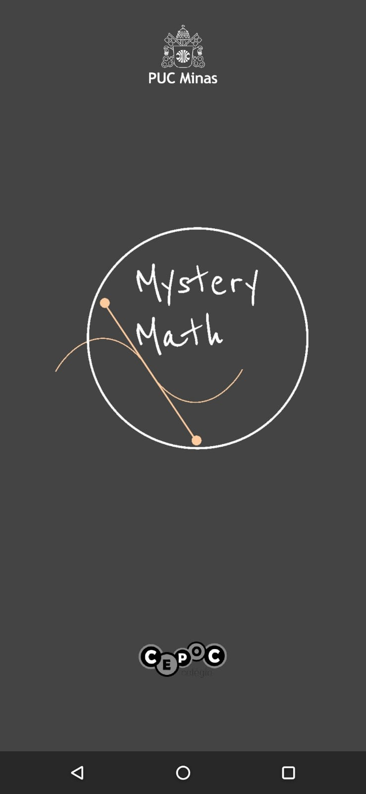
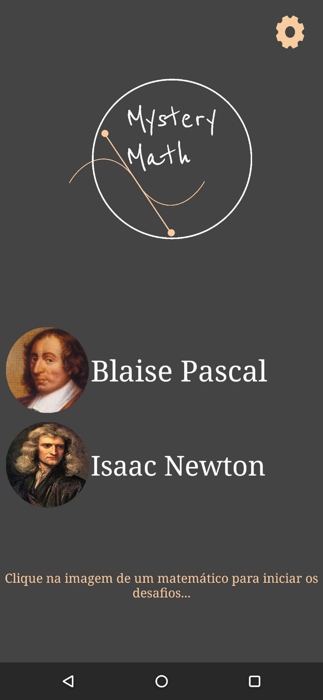
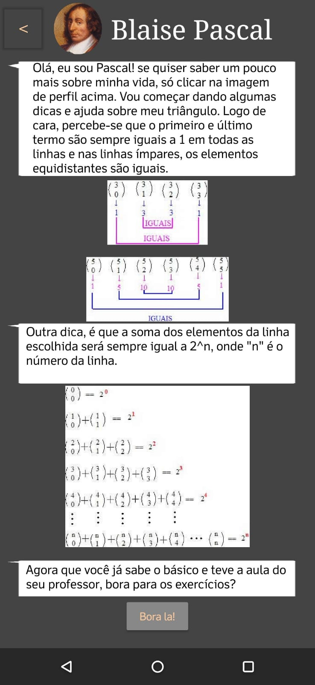
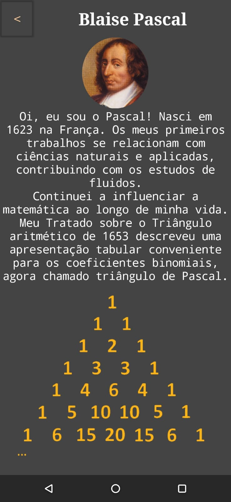
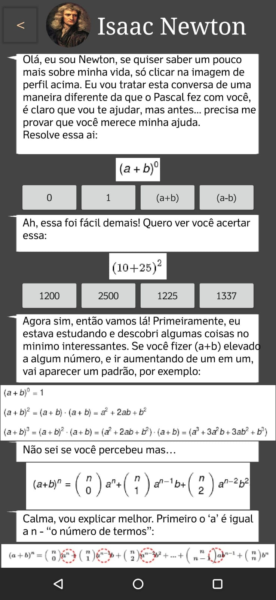

# Mystery Math 

Este projeto foi desenvolvido durante o 2º período da faculdade de Ciência da Computação, para a avaliação final da disciplina de Mentoring II em parceria da PUC Minas de Poços de Caldas com o Colégio Cepoc.

O objetivo deste projeto foi auxiliar um professor de matemática a dar aula aos alunos contando com uma temática  e proposta diferente da usual para atrair atenção dos alunos.

# Como funciona o jogo?
O Jogo consegue ser terminado em alguns minutos. Basicamente são teorias de alguns conteúdos matemáticos como o Triângulo de Pascal e Binômio de Newton e depois avançam para os exercícios propostos para testar os conhecimentos do aluno.
Além de conter parte sobre o conteúdo matemático, o jogo também conta com uma breve bibliografia de alguns matemáticos de antigamente, ao clicar sobre o perfil deles, você consegue acessar a essas informações.

# Download
O jogo está disponível para download através do link: [Download Mystery Math.apk (MEGA)](https://mega.nz/file/Dl1AyJbD#29qapIsflQELyJUJZOd4aWLHOiE_bK0iGomyhzx8z48)
 
 
# Screenshots do projeto

# Desenvolvedores

 - [Marcus Vinícius Ribeiro](https://www.linkedin.com/feed/)
 - [Elson Oliveira](https://www.linkedin.com/in/elson-oliveira-899827207/)
 - [Luiz Fernando](https://www.linkedin.com/in/luiz-fernando-6a8b93207/)
 - [Tuanne Assenço](https://www.linkedin.com/in/tuanne-assenco-cc/)
 - [Henrique Bianucci](https://www.linkedin.com/in/henrique-silva-bianucci-b54730200/)
